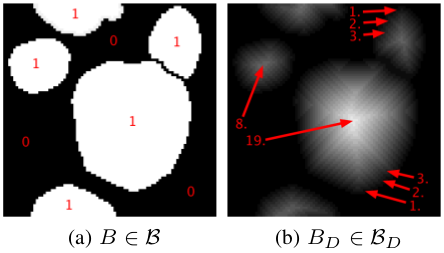
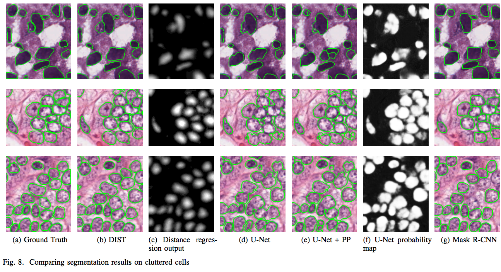
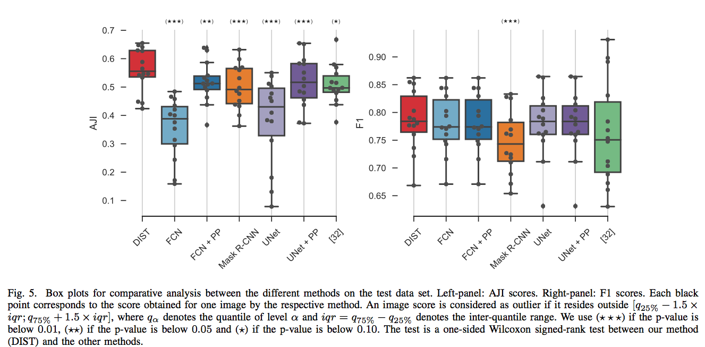

## Paper
The paper 'Segmentation of Nuclei in Histopathology Images by deep regression of the distance map' by *Peter Naylor, Thomas Walter, Fabien Reyal and Marick Laé* has been published in *IEEE transactions on medical imaging*, 2018.

## Data freely available
The data used for the study can be found [here](https://zenodo.org/record/1175282#.WyP61xy-l5E). 
The code can be found [here](https://github.com/PeterJackNaylor/DRFNS).
The results involving the comparaison of the different methods can be found [here](https://cloud.mines-paristech.fr/index.php/s/OxbkrVqkvtFGDyR).

## Summary of the paper
We focused on the problem of touching nuclei in histopathology images, i.e. instance segmentation applied to nuclei. We transform the standard classification problem into a regression problem. In other words, instead of predicting categorial variables we try to infer the distance between a given pixel and it's distance to the border, see figure 1. To recover the segmentation we apply a post-processing scheme that goes as follows: we join two maximum a posteriori of the distance map if and only if we can find a path that does not decrease of a certain size between them. This type of post-processing is ideally suited for the previous task. We believe that formulating the problem into a distance regression problem helps the model learn the concept of a cell better. Indead, the main difference with the standard classification arises in areas where the model is uncertain and will try to maximise per pixel probabilities. This situation does not arise with the distance regression and therefor creates nice and smooth segmentation results as one can see in figure 2 and 3. 

{:class="img-responsive"}
-> **Figure 1**: *Distance Regression Estimation* <-
B is the space of binary files and Bd is the distance transform of the previous space.
{:class="img-responsive"}
-> **Figure 2**: *Comparaison of different methods* <-
{:class="img-responsive"}
-> **Figure 3**: *Comparaison of different methods* <-

**U-Net**: refers to the method in the paper: Ronneberger, Olaf, Philipp Fischer, and Thomas Brox. "U-net: Convolutional networks for biomedical image segmentation." *International Conference on Medical image computing and computer-assisted intervention. Springer, Cham, 2015*.

**FCN**: refers to the method in the paper: Long, Jonathan, Evan Shelhamer, and Trevor Darrell. "Fully convolutional networks for semantic segmentation." *Proceedings of the IEEE conference on computer vision and pattern recognition. 2015*.

**Mask r-cnn**: refers to the method in the paper: He, Kaiming, et al. "Mask r-cnn." *Computer Vision (ICCV), 2017 IEEE International Conference on. IEEE, 2017*.

**[32]**: refers to the method in the paper: N. Kumar, R. Verma, S. Sharma, S. Bhargava et al. "A Dataset and a Technique for Generalized Nuclear Segmentation for Computational Pathology,", *IEEE Transactions on Medical Imaging, 2017*.