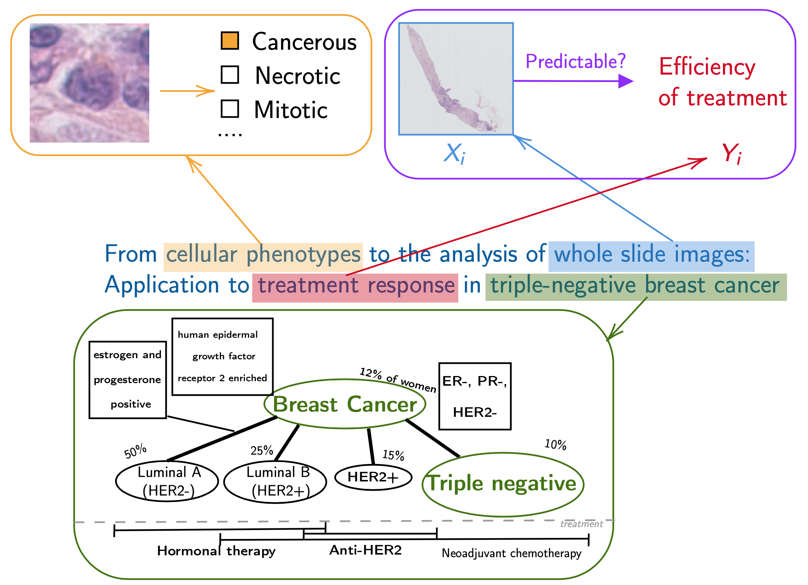

I defended my PhD on the 18th of December 2019 at 2 pm in amphitheater Lacassagne, [slides](http://members.cbio.mines-paristech.fr/~pnaylor/Downloads/PNaylor_defence.pdf) and the manuscript can be found here: [manuscript](http://members.cbio.mines-paristech.fr/~pnaylor/Downloads/PhD_PeterNaylor.pdf). I would like to thank my unofficial PhD supervisor Thomas Walter who was, expect for the title, my PhD supervisor. I would like to thank my official supervisor Jean-Philippe Vert.

My PhD is entitled: *From cellular phenotypes to the analysis of whole slide images: Application to treatment response in triple-negative breast cancer* and here is the first introductory slide discussing the title:

{:class="img-responsive"}
**Figure 1**: *Introductory slide of the PhD defence* 
