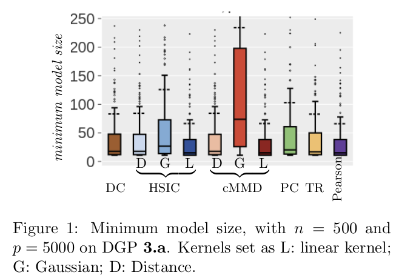
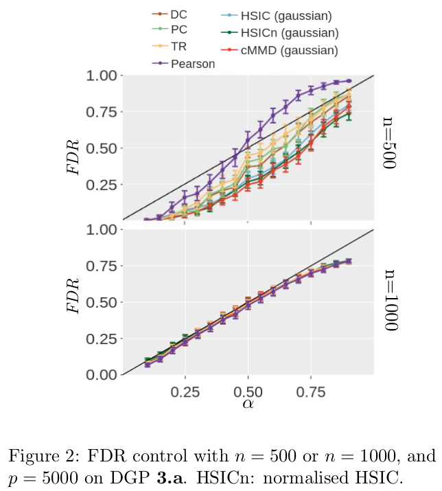
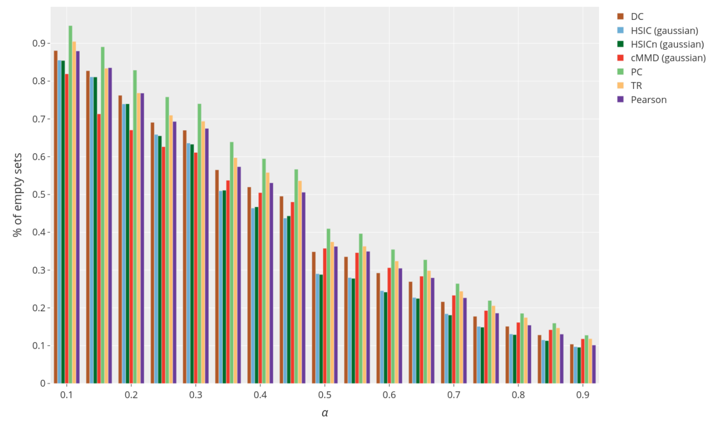
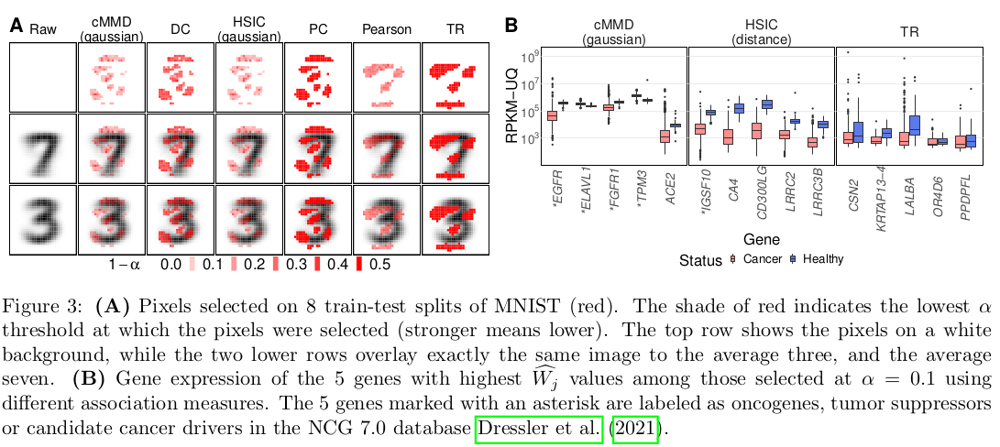

# Feature screening with kernel knockoffs

We have published the work [*Feature screening with kernel knockoffs*](https://proceedings.mlr.press/v151/poignard22a.html) by Benjamin Poignard, Peter Naylor, Héctor Climente-González, Makoto Yamada in AISTATS 2022. We presented the work at the conference in the [poster](https://drive.google.com/file/d/1zEtPHNcjajhOnCsc5boXSq9IPWvsh7Ja/view?usp=sharing) format.

## Introduction

Given a model, the knockoff filter aims at controlling the false discovery rate (FDR) while performing variable selection.

In other words, given a response variable and a large number of input variables can we select the important features to predict the response while assuring that the selections is indeed true and replicable.

## Paper contributions

- Theoretical convergences for new estimators, in particular the general association measure with any bounded kernel, for TR.
- In house validation on many simulated datasets
- Application to two real world datasets, in the context of low sample high dimensional, MNIST and TCGA.

## Notation

### Data and terminology

We denote by $X\in\mathbb{R}^{n\times p}$ the input data with $n$ samples and $p$ features and by $Y\in\mathcal{Y}^{n}$ the output or target prediction for $X$.

We also denote the set $\mathcal{S}$ being the collection of covariates, with any loss of generality we assume there exists a function $f$ such that $f(X_{\mathcal{S}}) = Y$.
In other words that the random variable $Y$ only depends on $X_S$: $Y | X_{\mathcal{S}} \perp X_{\mathcal{S}^{\mathsf{c}}}$ ($\perp$ means independence).

### FDR

The FDR can defined as: $FDR=\frac{n_s - n_p}{n_s}$ where $n_s$ is the number of selected feature and $n_p$ the number of correctly selected features. In particular, when $n_s = 0  \Rightarrow FDR = 0$.

## Key concept

The concept behind knockoff features is to compare and put in competition an original feature and its knockoff counterfeit.
In particular if the knockoff feature has higher significance or statistical power this would imply that the original feature is unimportant for the prediction of $Y$.

As an example for feature $j$, we can build simpler counterfeit by simply randomly permuting the feature wise sample. This counterfeit feature $\widetilde{X_j}$ is independent to $Y$ and the empirical distribution of $X_j$ and $\widetilde{X_j}$ are equal. If $\widetilde{X_j}$ is selected over $X_j$ this implies that the original feature is worse than a random one and that we can therefore drop this feature.

One issue with knockoff feature is that we do not look at joint effects on $Y$.

## The Knock off procedure

### Knock off feature properties

For a feature $j$ we wish that the knockoff feature $\widetilde{X_j}$ holds the following properties:

1. $\forall k, k\neq j, \text{corr}(\widetilde{X_j}, \widetilde{X_k}) = \text{corr}(X_j, X_k)$
2. $\forall k, k\neq j, \text{corr}(X_j, \widetilde{X_k}) = \text{corr}(X_j, X_k)$
3. $\widetilde{X_j} \perp Y$ ($\perp$ means independence)

### Statistics

We then define the $W_j$ statistic: $W_j = h(X_j) - h(\widetilde{X_j})$ where $h$ is some general function that measure the importance of the input feature with $Y$. This can be a number of things and has to be defined by the user.
For example it can be the coefficient in front of this feature in a linear regression model or simply its correlation to $Y$.

Under the hypothesis $\mathcal{H_0}$, the feature $X_j$ is unimportant to $Y$, $X_j$ and its knockoff feature are interchangeable implying that under this hypothesis $W_j$ is a symmetric random variable and centred around 0. In particular a strong positive value of $W_j$ implies a larger evidence that $X_j$ is important.

### A data-adaptative significance threshold

With knockoff we wish to control the FDR, the FDR can be estimate in the following manner, we denote by $\widehat{\mathcal{S}}$ the selected set.

We start from the FDR formulation given in the notation section and rewrite it:
$FDR = \frac{n_s - n_p}{n_s} = \frac{ |\lbrace j \in \widehat{\mathcal{S}} \text{ and } X_j \perp  Y \rbrace|}{|\widehat{\mathcal{S}}|}$

Actually, as a large and positive $W_j$ is evidence of importance, we would like to find $T_{\alpha}$ to threshold $\widehat{\mathcal{S}} = \lbrace j: W_j > T_{\alpha}\rbrace$ in order to control the FDR.

$$ T_{\alpha} = \text{min} \lbrace t>0; \frac{|\lbrace j: W_j \leq -t \rbrace |}{|\lbrace j: W_j \geq t \rbrace |} \leq \alpha \rbrace $$

As under $\mathcal{H_0}$ we have $\lbrace j: W_j \leq -t \rbrace \approx \lbrace j: W_j \geq t \rbrace$

### Knockoff in the low sample high dimensional setting

To create the knockoff features two paradigms exits, the model-X paradigm and the fixed-X paradigm. We only explain the latter as the first relies on knowing the distribution X which is impractical in real case scenarios.
In this paradigm two methods to create the variable exists, the equi-correlated and the SPD method.
We explain the first as it is the one used in the paper.
In addition a screening step is necessary when the data does not comply with $n \geq 2p$ and has to be reduced.

#### Knockoff variable - equi-correlated method

When $n\geq 2p$ and we define the matrix gram matrix G:
$$G = [X \ \widehat{X}]^T [X \ \widehat{X}] = \begin{bmatrix}\Sigma & \Sigma - \text{diag}(s)\\ \Sigma - \text{diag}(s) & \Sigma\end{bmatrix}$$
Where $\Sigma = X^T. X$.

We define $\widetilde{U}$ via the Gram–Schmidt process such that $\widetilde{U}^T.X = 0$, this matrix exists because of $n\geq 2p$.
We can define $\widetilde{X} = X(I - \Sigma^{-1}\text{diag}(s)) + \widetilde{U}C$
 and where $C^TC = 2\text{diag}(s) - \text{diag}(s)\Sigma\text{diag}(s)$. (To note $\Sigma$ isn't invertible if we don't have $n\geq 2p$.)

it is easy to show that $\widetilde{X}$ define above verifies the knockoff features expressed above.

How to choose $s$? For a given feature we would like to have $X_j$ as uncorrelated to $\widetilde{X_j}$ as possible, which implies $\widetilde{X_j}^T . X_j = 1 - s_j$ is as close to zero as possible.
To choose $s$ we can choose or the equi-correlated method or the SPD method.
In the equi-correlated version we set $s_j = 1 - \text{max}(2\lambda_{\text{min}}, 1)$ where $\lambda_{\text{min}}$ is the smallest eigen value of $\Sigma$.

#### Data splitting

In the low sample high dimensional setting we have $n << p$ and not $n\geq 2p$.
In order to be in the correct setting we split the data into $X_0$ and $X_1$. We use the screening step on $X_0$ and retain the top $d$ features such that $n_1\geq 2d$. We then apply the knockoff procedure on $X_1$ and indeed project our data into the correct setting.

## Association measure

### Classical measure

- Absolute value of the pearson measure
- Kendall's Tau and Spearman Rho, $TR(X, Y) = 3 \tau (Y, X) - 2 \rho (Y, X)$
- Projection correlation [1]

### Kernel measure

We show theoretical bounds and convergences for a general kernel knockoff association measure as well as the sure screening properties.
For a given kernel $\varphi$ that can be the linear, gaussian or distance we define the following association measures:

- $HSIC(X,Y) = \frac{1}{n-1}\text{tr}(KHLH)$ where is the centring matrix $H = I_n - \frac{1}{n} \mathbf{1}\mathbf{1}^T$ and $K_{ij} = \varphi(x_i, x_j)$ and $L_{ij} = \varphi(y_i, y_j)$

$\lbrack$

$$ cMMD(X,Y) = \mathbb{E}_{X_kX'_k}\lbrack \varphi(X_k, X_k') \sum$$

- Conditional MMD: $ cMMD(X,Y) = \mathbb{E}_{X_kX'_k}\lbrack \varphi(X_k, X_k') \lvert Y, Y' \rbrack - \mathbb{E}_{X_kX'_k} \lbrack \varphi(X_k, X'_k) \rbrack $.

In practice, this simplifies to $cMMD(X,Y) = \overset{L}{\underset{l=1}{\Sigma}} \widehat{\pi}_l \frac{1}{n^2_l}\underset{i,j \in \mathcal{E}_l}{\Sigma}\varphi(X_{ik},X_{jk}) - \frac{1}{n^2}\overset{n}{\underset{i,j=1}{\Sigma}}\varphi(X_{ik},X_{jk})$.
Where  $\mathcal{E}_l = \lbrace i: Y_i = l\rbrace$

### $W_j$ statistic

For each association $AM$, for feature $k$, we define $w_k = AM(X_k, Y)$ and $\widehat{w_k} = AM(\widehat{X_k}, Y)$.
We define $W_k = w_k - \widehat{w_k}$.

## Experiments

### Data

#### Simulated

We experiment with more than 9 different data simulations.
If unspecified, $\varepsilon \sim \mathcal{N}(0, c)$

1. Linear data:
$\textbf{1.a : }  Y = \beta_0 . X_\mathcal{S} + \varepsilon, \text{ where } \beta_0 = (1, 2, 4, 8).$

2. Non linear data:
$\textbf{2.c : } Y \sim \mathcal{P}(\lambda)$, where $\mathcal{P}$ is the Poisson distribution where $\lambda = \exp\lbrace \overset{10}{\underset{i=1}{\sum}} X_i \rbrace$

3. Categorical data: $\textbf{3.a : } Y= \textbf{1}\lbrace \text{logit}(\overset{10}{\underset{i=1}{\sum}} X_i +  \varepsilon) > 0.5\rbrace$

#### Real data

- MNIST dataset split into 3 and 7, 500 of each and each sample
- TCGA data for gene expression (56 602 genes obtained from 1 215 samples)

### Results

#### Sure screening

We show that given a certain size, we recover the true features with a given probability. The minimum model size corresponds to the lowest rank so that the true features are pass the screening selection.

We show that the FDR is indeed controlled for all association measure, n, p and $\alpha$.

The FDR control is to be put in perspective with the number of feature actually selected shown below.

#### Real data experiments

In Figure (A) we show the selected pixel and show that indeed these pixel are pertinent to differentiate between the digit 3 and 7.
We do a similar analysis for Figure (B), as we show, 5 of those 15 genes have been linked to cancer, supporting the notion that the protocol is selecting relevant features.

## References and material

- [stanford group](https://web.stanford.edu/group/candes/knockoffs/index.html)
- The code to run the experiments can be found in the following github repository: [Knockoff-MMD-HSIC](https://github.com/PeterJackNaylor/knockoff-MMD-HSIC).
- [1] W. Liu, Y. Ke, Liu J., and R. Li. *Model-free feature screening and fdr control with knockoff features.* Journal of the American Statistical Association, 2020.
